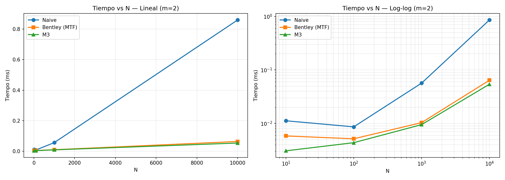
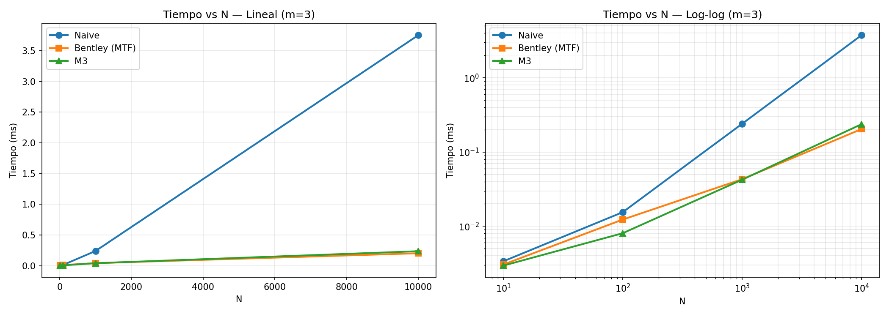
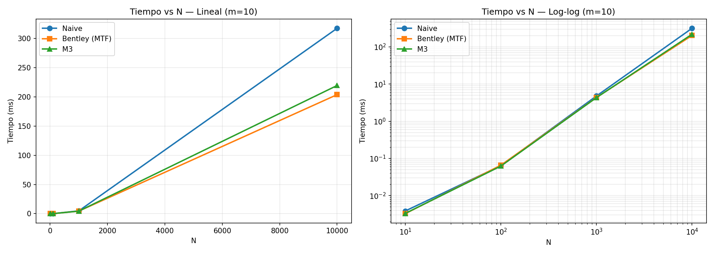
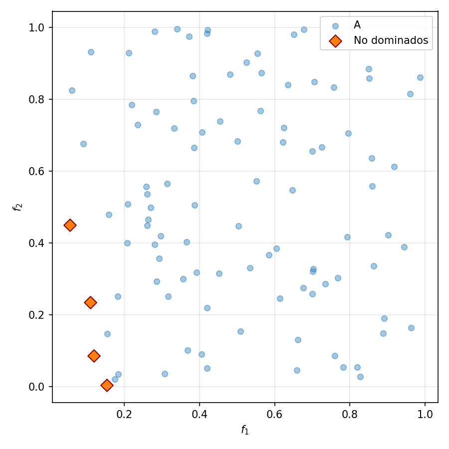
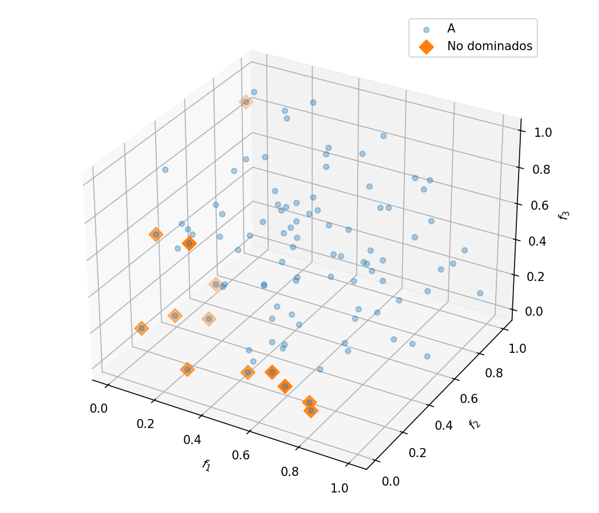
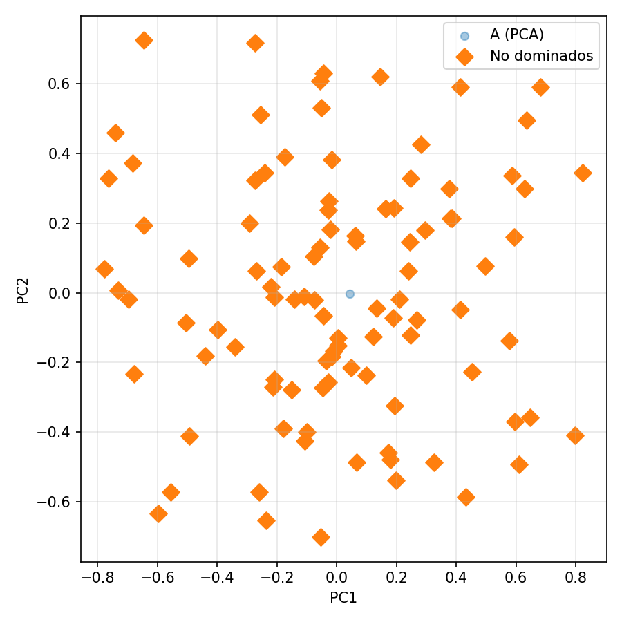
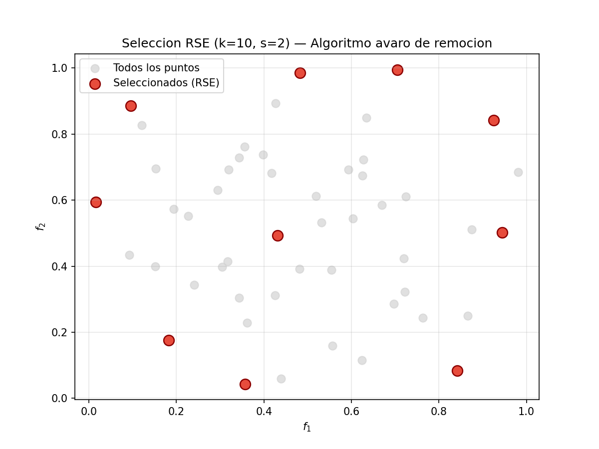
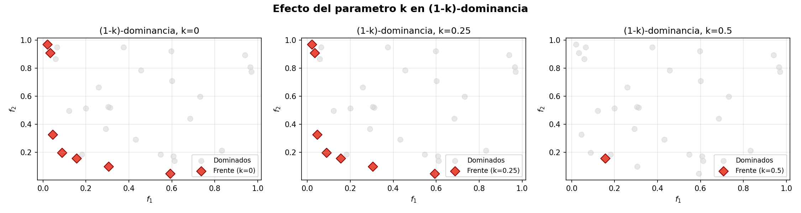

# 🧬 EMO-CICESE-Practices

**Evolutionary Multi-Objective Optimization**  
**CICESE** — Centro de Investigación Científica y de Educación Superior de Ensenada

| | |
|---|---|
| **Student** | Javier Ramírez González ([javier.ramirez@cicese.edu.mx](mailto:javier.ramirez@cicese.edu.mx)) |
| **Instructor** | Dr. Jesús Guillermo Falcón Cardona |
| **Semester** | 2026-2 |

---

## 📋 Overview

Hands-on lab assignments for the course *Evolutionary Multi-Objective Optimization*. This repository contains implementations, experiments, and reports on non-dominated sorting algorithms, density estimators, relaxed dominance relations, and NSGA-II variants.

> ⏳ *More assignments will be added as the course progresses.*

---

## 📂 Repository Structure

```
EMO-CICESE-Practices/
├── HW1/                          # Homework 1 — Non-dominated sorting algorithms & NSGA-II variants
│   ├── EMO_HW1.pdf               # LaTeX report (PDF)
│   ├── HW1_JR.ipynb              # Jupyter Notebook with full report
│   ├── HW1_JR.pdf                # Report exported from notebook
│   ├── nd_algorithms.py          # Non-dominated sorting (Naive, Bentley MTF, M3)
│   ├── moea_module.py            # MOEA components: RSE, (1-K)-dominance, NSGA-II variants
│   ├── gen_moea.py               # Notebook cell generation script
│   ├── HW1_JR_images/            # 54 figures embedded in the notebook
│   └── resultados/
│       ├── csv/                  # Numerical results (averaged and detailed)
│       ├── figuras/              # Pareto fronts 2D/3D/10D and demo plots
│       └── graficas/             # Time vs N plots
├── LICENSE                       # MIT License
└── README.md
```

---

## 🧪 Homework 1 — Non-Dominated Sorting Algorithms

### Implemented Algorithms

Three algorithms for finding the **non-dominated set** of `N` points in `m` dimensions:

| Algorithm | Worst case | Average case (uniform) |
|-----------|-----------|------------------------|
| **Naive** | O(mN²)    | O(mN²) |
| **Bentley MTF** | O(mN²) | O(N^{1+o(1)} + mN) |
| **M3** | O(mN²) | O(N^{1+o(1)} + mN) |

#### Naive

```
1:  dominated ← boolean array of size N (initialized False)
2:  for i in {0..N-1}:
3:      for j in {0..N-1}, j ≠ i:
4:          if A[j] dominates A[i]:
5:              dominated[i] ← True
6:              break
7:  return indices where dominated is False
```

#### Bentley with Move-To-Front (MTF)

```
1:  active ← empty list
2:  for each point p in A:
3:      dominated ← False
4:      for each candidate q in active:
5:          if q dominates p:
6:              move q to front of active  (MTF heuristic)
7:              dominated ← True
8:              break
9:          if p dominates q:
10:             remove q from active
11:     if not dominated:
12:         append p to active
13: return active
```

#### M3

```
1:  active[0] ← 0, top ← 0
2:  for each point p in A[1..N-1]:
3:      j ← 0, dominated ← False
4:      while j ≤ top:
5:          q ← active[j]
6:          if q dominates p:
7:             swap active[0] ↔ active[j]
8:             dominated ← True
9:             break
10:         if p dominates q:
11:             swap active[j] ↔ active[top]
12:             top ← top - 1
13:         else:
14:             j ← j + 1
15:     if not dominated:
16:         top ← top + 1
17:         active[top] ← i
18: return active[0..top]
```

---

### 🧪 NSGA-II Variants

Three algorithms evaluated on 7 benchmark problems (DTLZ1, DTLZ2, DTLZ7, WFG1, WFG3, IDTLZ1, IDTLZ2) with `m ∈ {2,3,5,8,10}`, 30 runs each, using **Hypervolume (HV)** as the quality metric:

| Algorithm | Description |
|-----------|-------------|
| **NSGA-II** | Classic algorithm with crowding distance (baseline) |
| **RSE-NSGA-II** | Replaces crowding distance with **Riesz s-Energy** density estimator (greedy removal) |
| **R-NSGA-II** | Replaces Pareto dominance with **(1-K)-dominance** (tolerates being worse in up to `k·m` objectives) |

#### RSE (Riesz s-Energy)

```
1: Normalize objectives F → [0,1]
2: Compute Riesz energy matrix: K_ij = 1 / ‖f_i - f_j‖^s
3: contrib ← row-wise sum of K
4: While n_alive > n_survive:
5:     idx = argmax(contrib)      # point with highest energy contribution
6:     remove idx from set
7:     contrib ← contrib - K[:, idx]
8: Return surviving indices
```

#### (1-K)-Dominance

```
Given a, b ∈ ℝ^m and k ∈ [0,1]:
    a (1-k)-dominates b iff:
        |{i : a_i ≤ b_i}| ≥ m - ⌊k·m⌋   (better or equal in at least m-k·m objectives)
        and |{i : a_i < b_i}| ≥ 1        (strictly better in at least one)
```

---

## 📊 Key Plots

### Execution time vs N (sorting algorithms)

| m=2 | m=3 | m=10 |
|:---:|:---:|:----:|
|  |  |  |

*Execution time (linear and log-log scales) for m = 2, 3, 10 with N ranging from 10 to 10000. M3 and MTF are ≈17× faster than Naive for m=2 at N=10000.*

### Pareto fronts (DTLZ2)

| m=2 | m=3 | m=10 (PCA) |
|:---:|:---:|:----------:|
|  |  |  |

*Pareto fronts obtained with NSGA-II for m = 2, 3, 10 (PCA projection for m=10) with N=100.*

### RSE & (1-K)-Dominance demos

| RSE subset selection | (1-K)-dominance |
|:-------------------:|:---------------:|
|  |  |

*Left: 10 points selected out of 50 using RSE. Right: (1-K)-dominance with k = 0, 0.25, 0.5.*

---

## 🛠️ Tech Stack

| Tool | Purpose |
|------|---------|
| Python 3.12 | Core language |
| NumPy | Numerical computing |
| Numba | JIT compilation (ND algorithms) |
| pymoo | MOEA framework (NSGA-II, benchmarks) |
| SciPy | RSE (pdist), PCA |
| Matplotlib | Visualization |
| Jupyter | Interactive report |

---

## 📄 License

MIT License — Copyright © 2026 Javier Ramírez González
